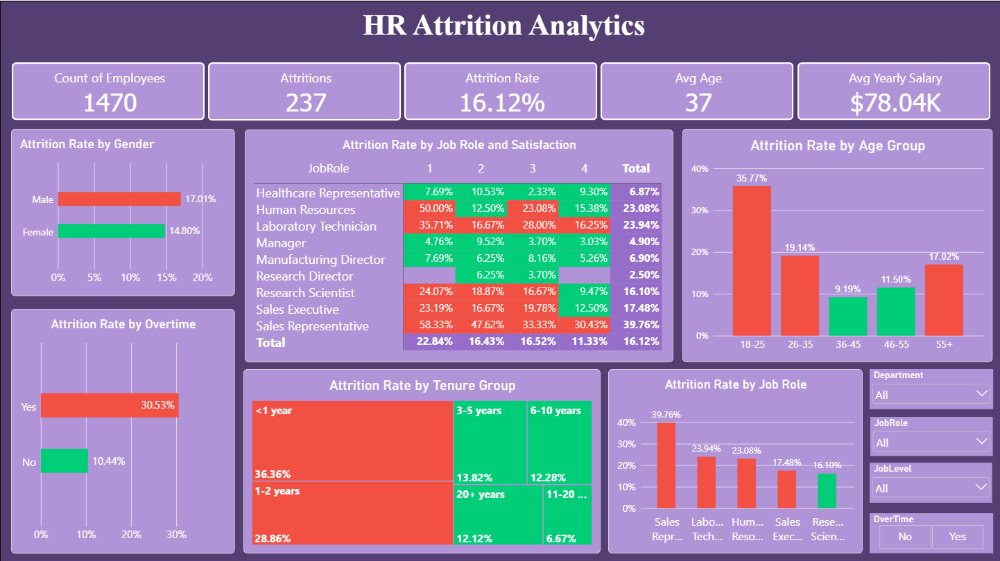
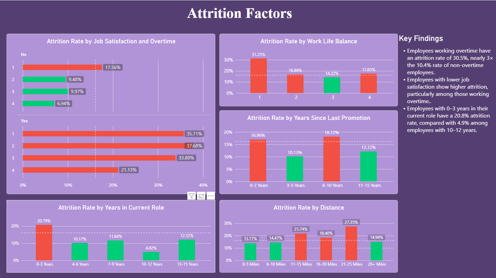
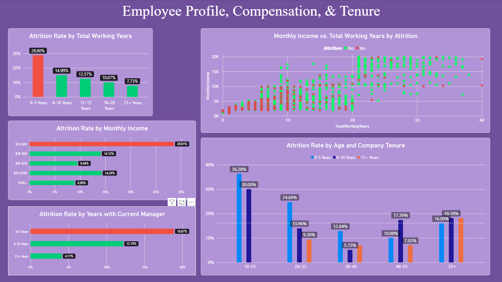

# HR Employee Attrition Analysis

Source: https://www.kaggle.com/datasets/rishikeshkonapure/hr-analytics-prediction

## Overview

This project was to analyze the factors that contribute the most to why employees attrition. 

## Objectives

- Analyze employee attrition patterns
- Identify employee/workplace characteristics associated with attrition
- Explore relationships between compensation, experience, age, and tenure
- Build an interactive Power BI dashboard

## Dataset

This dataset contains 1470 rows of data, with each row representing a single employee. This data contains information such as: Age, Marital Status, Years with the Company, Years since last Promotion, Monthly Income, etc. 

## Tools & Technologies

- Python
- Pandas
- NumPy
- Matplotlib
- Seaborn
- Power BI
- DAX

## Exploratory Data Analysis

The Jupyter Notebook contains futher analysis to help determine categorical groups for attributes such as monhtly income, total working years, etc. in order to better show the separation of these groups and their individual attrition rates. It was also used to help determine correlations between certain variables that may contribute to attrition. 

## Power BI Dashboard

### Page 1 — HR Attrition Analytics

- Attrition Rate: 16.12%
- Men attrition more then Women, but only by a slight amount
- Overtime has a large effect on attrition, doing so at a rate 3x higher than employees who did not work overtime
- The most common attrition groups have a tenure of 2 or less years
- The highest attrition rate by role is Sales Representatives
- Employees 35 and younger as well as older than 55 have the highest risk of attrition

### Page 2 — Attrition Factors

- Employees working overtime have an attrition rate of 30.5%, nearly 3× the 10.4% rate of non-overtime employees.
- Employees with lower job satisfaction show higher attrition, particularly among those working overtime..
- Employees with 0–3 years in their current role have a 20.8% attrition rate, compared with 4.9% among employees with 10–12 years.

### Page 3 — Employee Profile, Compensation & Tenure

- As the number of total working years goes up, the attrition rate appears to go down.
- We can see in the scatterplot that employees with less than 10 years of total working years attrition much more commonly, signified by the large cluster of red (attrition) points, compared to the more spread out points past the 10 year mark. 

## Key Findings

1. Overtime employees have substantially higher attrition, at early 3x the frequency of non-overtime employees
2. Attrition is highest among employees with lower total working experience, specifically, 10 years or less
3. Sales Representatives have a much higher than normal attrition rate (nearly 2.5x higher)
4. Early career professional (age 18-25) have much higher attrition rates than people who are mid/late career. 